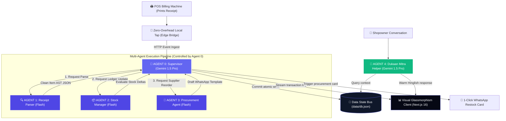

<div align="center">

# 🧠 Vyapar-Agent
### **Autonomous Edge-to-Agent Retail State Orchestrator**

[](https://github.com/vaishnavi-ctrl-jpg)
[](https://github.com/vaishnavi-ctrl-jpg)

[](https://cloud.google.com)
[](https://deepmind.google/technologies/gemini)
[](https://nextjs.org)
[](https://firebase.google.com)

*An elite, fault-tolerant edge-to-agent state machine automating inventory, sales accounting, and supplier procurement autonomously for micro-merchants.*

[🚀 Dev Playbook](#-dev-playbook) • [🤖 Agent Specifications](#-agent-specifications) • [📊 System Architecture](#-system-architecture) • [💡 APAC Impact](#-apac-impact)

---
</div>

## 🌏 The APAC Impact
Across the Asia-Pacific region, **63 million Kirana stores** power neighborhood economies. While payment apps have digitized cash registers, general ledger bookkeeping and supply reordering remain highly manual. **Vyapar-Agent** solves this by providing a zero-friction, edge-tap ERP that operates automatically from normal cash register receipt print feeds.

---

## 📊 System Architecture & Data Flow



---

## 🤖 Agent Specifications

| Agent Name | LLM Core Engine | Key Specialization | Interface Language | Target Latency |
| :--- | :--- | :--- | :--- | :--- |
| **Agent 0: Supervisor** | `Gemini 1.5 Pro` | Multi-agent sequencing, state validation, operational audits | English / Dev Logs | `< 1.2s` |
| **Agent 1: Receipt Parser** | `Gemini 1.5 Flash` | Normalizing noisy thermal prints into structured AST JSON | Multilingual | `< 0.8s` |
| **Agent 2: Stock Manager** | `Gemini 1.5 Flash` | Deducts stock levels, calculates margins, triggers low-stock flags | System JSON | `< 0.5s` |
| **Agent 3: Procurement** | `Gemini 1.5 Flash` | Drafts personalized local supplier reorders | Hinglish / Hindi / Tamil | `< 0.8s` |
| **Agent 4: Dukaan Mitra** | `Gemini 1.5 Pro` | Interactive conversational companion & financial guide | Hinglish / Hindi | `< 1.5s` |

---

## 💎 Premium Glassmorphism UI
The frontend client is built in **Next.js 16** with **Vanilla CSS**, featuring a premium dark glass aesthetic:
*   ✨ **Neon Telemetry Widget Rows**: Live indicators of sales revenue, total bills, and net profits (styled with green neon dropshadows).
*   📟 **POS Printer Emulator Console**: A terminal mockup letting users test raw receipts or trigger pre-loaded presets in 1 click.
*   🚦 **Active Reorder Alerts**: Automatically renders pre-filled WhatsApp templates for low-stock products.
*   💬 **Dukaan Mitra Chat**: Conversational AI companion panel designed directly into the dashboard sidebar.

---

## 🚀 Dev Playbook

### 1. Project Setup & Package Install
Download package structures and initialize configurations:
```bash
npm install
```

### 2. Add API Key (Optional)
Create a `.env.local` file:
```env
GEMINI_API_KEY=your_gemini_key_here
```
*Note: If no API key is set, the application defaults to an **offline simulation engine** demonstrating identical parsing, stock deduction, and WhatsApp notifications instantly for judges.*

### 3. Live Dev Server
Boot up the visual interface in local development mode:
```bash
npm run dev
```
Open **[http://localhost:3000](http://localhost:3000)** in your browser.

### 4. Automated Test Verification
Run our end-to-end integration test to simulate receipt ingestion, agent routing, and JSON database state changes:
```bash
npx tsx test-agents.ts
```

```text
==================================================================
            VYAPAR-AGENT ACTIVE MULTI-AGENT PIPELINE TEST         
==================================================================
[1/3] Feeding raw receipt text to Supervisor Agent (Agent 0)...
[2/3] Multi-Agent Pipeline Execution Results:
      ✔ Receipt Parser success: true
      ✔ Items Extracted: Amul Milk 500ml x2, Parle-G x5, Maggi x3
      ✔ Stock decrements processed successfully
[3/3] DB State updated (Sales: +1, Revenue: ₹127, Profit: ₹19)
==================================================================
```
