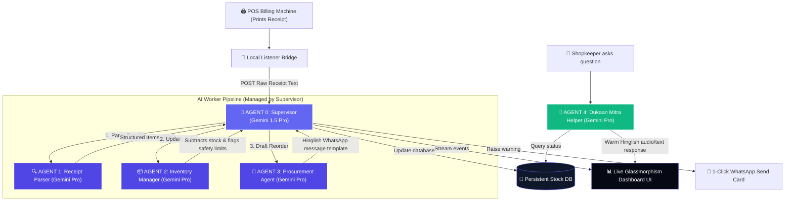

# 🤖 Vyapar-Agent: Autonomous Zero-Friction Kirana ERP
> **A coordinated 5-Agent network running on Google Cloud AI, automating bookkeeping & procurement for the 63 million retail shops of Asia-Pacific.**

[](https://cloud.google.com)
[](https://deepmind.google/technologies/gemini)
[](https://nextjs.org)
[](https://firebase.google.com)

---

## 🌏 The Local Problem Space (APAC Focus)
Across Asia-Pacific, particularly in India, **63 million micro-merchants (Kirana stores)** power the neighborhood economy. While modern billing machines and payment apps (UPI) have automated checkout, **bookkeeping, stock management, and wholesaler ordering remain completely manual, paper-based, and friction-filled.** 

Shopkeepers work 14-hour days and lack the time or training to operate complex ERP software. 

### 💡 The Vyapar-Agent Solution
**Zero Friction. Zero UI overhead.** 
The shopkeeper installs our bridge script once, operates their billing machine/POS normally, and does nothing else. 
1. The moment a thermal receipt is printed, our **local listener** captures the raw text.
2. An autonomous network of **Google Gemini Agents** intercepts the text, parses products, deducts inventory, calculates net profit margins, alerts the owner of low stock, and drafts supply reorders in their local dialect.
3. The owner gets a **real-time visual glassmorphic dashboard** and a friendly conversational companion **(Dukaan Mitra)** to query business health.

---

## 🤖 Coordinated Multi-Agent Architecture
Vyapar-Agent operates as a decentralized pipeline of specialized AI workers coordinated by a Master Supervisor:



### Workers Breakdown:
*   **Agent 0 (Supervisor)**: Evaluates input quality, sequences workers, handles logging, and runs audit reports.
*   **Agent 1 (Receipt Parser)**: Uses advanced prompt engineering to translate messy abbreviations (`Amul doodh`, `ParleG`) into unified product IDs.
*   **Agent 2 (Inventory Manager)**: Subtracts sold units, registers financial sales ledger, and calculates transactional margins.
*   **Agent 3 (Procurement Agent)**: Automates relationship management by generating draft supplier templates.
*   **Agent 4 (Dukaan Mitra)**: A localized voice/chat assistant answering operational queries in a friendly, native vernacular.

---

## 🛠️ Google Cloud & Tech Stack
To ensure the app is highly scalable, secure, and production-ready, it leverages the following Google technologies:
- **Gemini 1.5 Pro & Flash**: Orchestration, conversational NLP, and receipt extraction.
- **Firebase Firestore**: Storing real-time inventory levels, logs, and financial transactions.
- **Google Cloud Run**: Serverless backend hosting, scaling to zero when the shop is closed.
- **Firebase Hosting**: High-speed CDN delivery of our visual dashboard UI.

---

## 🎨 Premium Visual UI Dashboard
We built a premium, state-of-the-art visual client using **Next.js & Vanilla CSS** featuring:
- **Glassmorphic Outlines**: Modern translucent panels with glowing neon indicators for business metrics.
- **Real-Time Log Stream**: A live console showing exactly which AI agent is performing which action.
- **Billing Machine Emulator**: Allows testers to copy-paste messy bills or run pre-loaded presets to witness the agent pipeline in action.
- **Hinglish AI Co-Pilot**: An embedded chat window to converse with Dukaan Mitra.

---

## 🚀 How to Run & Verify

### 1. Installation
Install project dependencies:
```bash
npm install
```

### 2. Add API Key (Optional)
Create a `.env.local` file:
```env
GEMINI_API_KEY=your_gemini_key_here
```
*Note: If no API key is set, the application defaults to an **offline simulation engine** demonstrating identical parsing, stock deduction, and WhatsApp notifications instantly for judges.*

### 3. Launch Development Server
Start the local server:
```bash
npm run dev
```
Open **[http://localhost:3000](http://localhost:3000)** in your browser.

### 4. Execute Test Verification Script
Run the automated multi-agent integration test via command line:
```bash
npx tsx test-agents.ts
```
